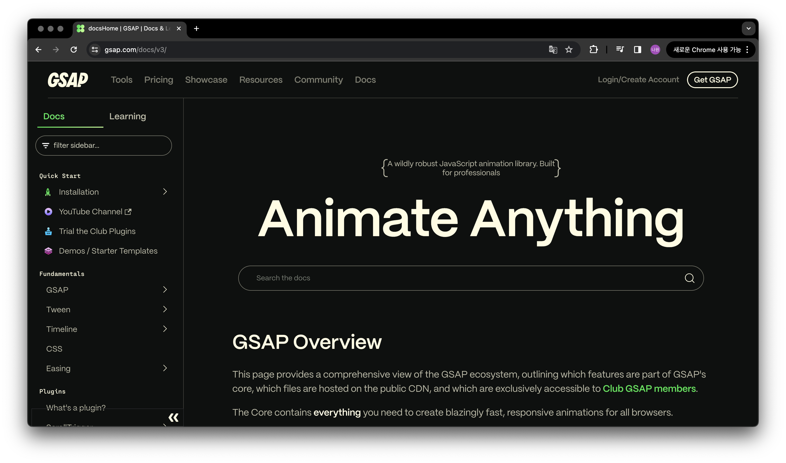
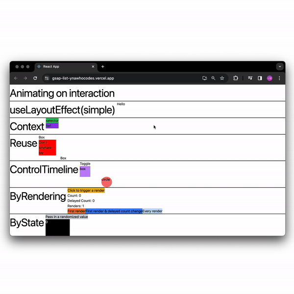
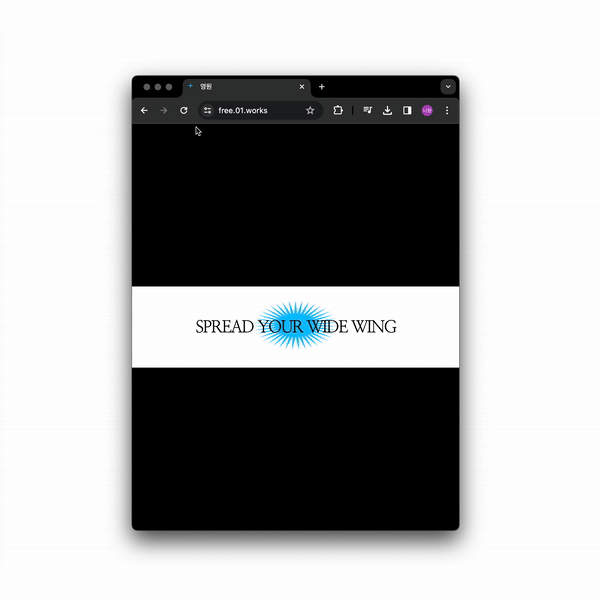
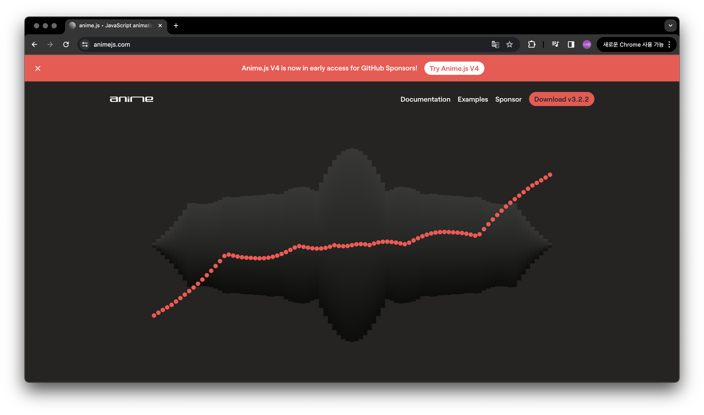
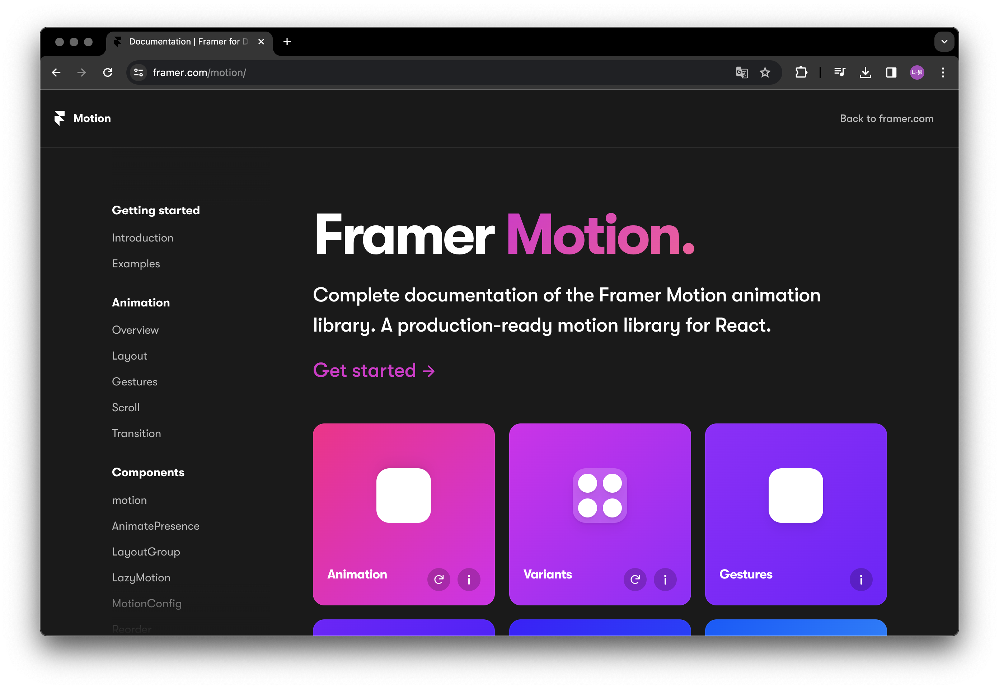
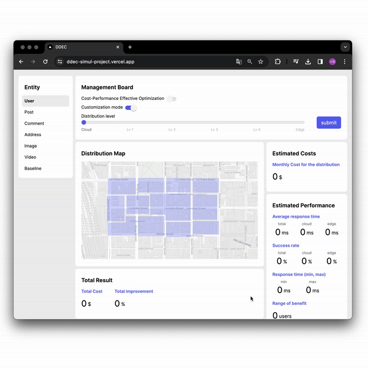
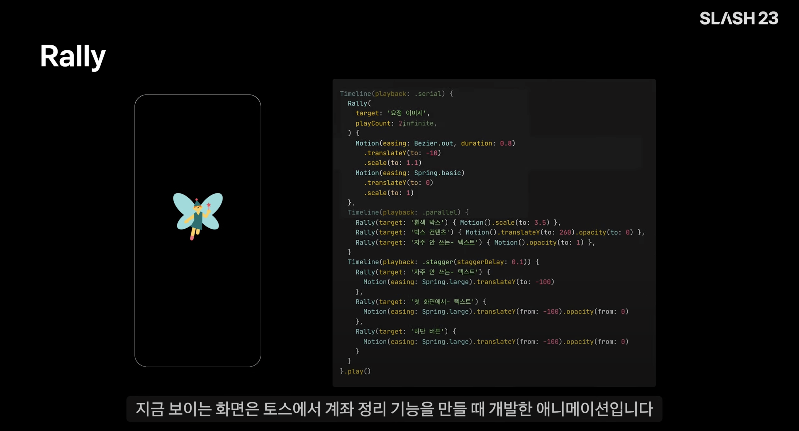

안녕하세요. 벌써 인터렉티브 개발 스튜디오 '영원'을 운영한지 7개월차에 다다릅니다...! ✌️  

인터렉션 활동을 더 활동적이게 하고 싶어 영원을 시작했고, 그 덕분에 다양한 애니메이션 라이브러리를 사용해봤는데요. 써볼수록 각각 특징들이 점점 보이더라고요. 오늘은 그 점을 공유하고 싶어 글을 써봅니다.

## 🎙️ 우선 써본 라이브러리/프레임워크 소개해주세요

입문한 순서대로 소개하자면

1. GSAP 2) anime.js 3) Framer-motion (써보지 못 한(4) Rally)

참고로 Rally는 토스가 만든 플랫폼 공통 애니메이션 라이브러리기 때문에 제가 써보지 못 했습니다만, 토스 SLASH 23 영상 [⌜Rally로 3분 만에 애니메이션 완성하기⌟](https://youtu.be/Jq4MzgzSDEE?si=5Guv53wPzLhzn3F8)을 최근에 보고 Rally도 제가 지금까지 써본 라이브러리와 유사한 점이 보여 이 글을 쓰고자 했기에 Rally도 추가해보겠습니다.

## 첫번째, GSAP

> 브라우저 호환성 걱정없이 스크롤에 따라 반응하는 애니메이션을 만들고 싶다하면 GSAP 추천합니다요



[GSAP docs](https://gsap.com/docs/v3/) 해당 페이지에서 GSAP의 전체 기능을 한 눈에 볼 수 있어 좋더라고요.  
이처럼 다양한 기능과 플러그인이 있습니다.

```
import { gsap } from "gsap";

const box = document.querySelector(".box");

gsap.to(box, {
    duration: 1,
    x: 100,
    y: 50,
    rotation: 360,
    scaleX: 2,
    scaleY: 0.5,
    ease: "power2.inOut",
    delay: 0.5,
    onComplete: () => {
        console.log("애니메이션 완료!");
    }
});

```

이렇게 기본적으로 애니메이션을 설정할 수 있고,
애니메이션의 순서를 더욱 세밀하게 작업하기 위해 타임라인을 사용하면

```
// 타임라인 사용 안할 때
gsap.to("#id", { x: 100, duration: 1 });
gsap.to("#id", { y: 50, duration: 1, delay: 1 }); // 1초 기다리고
gsap.to("#id", { opacity: 0, duration: 1, delay: 2 }); // 2초 기다리고

// 타임라인 사용할 때
var tl = gsap.timeline({repeat: 2, repeatDelay: 1});
tl.to("#id", {x: 100, duration: 1});
tl.to("#id", {y: 50, duration: 1});
tl.to("#id", {opacity: 0, duration: 1});

tl.pause();
tl.resume();
tl.seek(1.5);
tl.reverse();
...
```
위와 같이 애니메이션 간의 타임라인도 설정할 수 있습니다.


제가 GSAP을 통해 만든 사이트로는 두가지가 있는데요

- **GSAP 입문 페이지**
    
   
    > [GSAP 입문 페이지로 이동](https://gsap-list-ynawhocodes.vercel.app/)  
    
    GSAP 공식문서를 보며 React 내에서 사용해보며 입문했던 프로젝트입니다.

    React의 장점인 컴포넌트 구성으로 애니메이션을 컴포넌트화하여 쓸 수 있는 장점이 있었고, React 내에서 썼기에 hooks을 이용해 state를 통해 상태관리하고, ref를 이용해 DOM 요소에 접근하고, effect로 부수효과 처리하는 특징이 있었습니다.

- **FREE EVENT 이벤트 페이지**

    
    > [FREE EVENT 페이지로 이동](https://free.01.works/)

    이벤트 소개를 위한 긴 글을 최대한 가독성있게 전달하고자 GSAP Text와 ScrollTrigger 플러그인을 사용하여 영원 이벤트 소개 페이지를 만들었습니다.
    
    GSAP의 ScrollTrigger 플러그인이 GSAP의 큰 장점이라고 생각합니다.

    ```
    import anime from 'animejs/lib/anime.es.js';

    const box = document.querySelector(".box");

    window.addEventListener("scroll", () => {
        const bounding = box.getBoundingClientRect();

        if (bounding.top < window.innerHeight && bounding.bottom >= 0) {
            anime({
                targets: box,
                translateY: [0, 200],
                opacity: [1, 0],
                duration: 1000,
                easing: 'easeInOutSine'
            });
        }
    });

    ```

    만약 GSAP의 ScrollTrigger 플러그인을 사용하지 않았더라면 위와 같이 스크롤 이벤트를 사용하여 구현했을텐데 플러그인 덕분에 간편하게 스크롤에 따라 반응하는 애니메이션을 구현할 수 있었습니다.
    (하지만 이후 Framer의 Scroll Effect를 사용했을 땐 더더욱 편리해서 놀라긴 했습니다...)

GSAP 총평, 제가 느낀 장점으로는

1. 애프터이펙트 영상 편집하듯 애니메이션 효과를 아주 세밀하게 조절 가능하다.
2. 역사가 길어 문서나 이슈 리포트가 많아 오류 해결에 용이하다.
3. 스크롤에 따른 애니메이션 제어를 하고 싶다면 GSAP을 추천한다.
4. 브라우저 간의 호환성 문제를 걱정할 필요 없이 안정적으로 동작한다. (IE같은 구형 브라우저의 경우 용이)

## 두번째로 Anime.js

> IE에서 동작할 필요 없고, 스크롤 애니메이션도 필요없고.., 그저 간단한 애니메이션 구현하고 싶다면 anime.js 추천합니다요

  
[Anime.js](https://animejs.com/documentation/)는 GSAP보다 용량이 가벼우며 웬만한 애니메이션 제어는 모두 가능합니다.  
(물론 GSA도 CDN을 통해 필요한 모듈만 다운받으면 용량 최적화도 가능합니다.)

공식문서도 필요한 애니메이션을 찾기 수월해서 공식문서만 켜놓고 개발하니 기본적인 애니메이션 구현하는데 큰 어려움이 없었습니다.

또한, GSAP과 동일하게 애니메이션 실행을 위한 `1) 애니메이션 적용할 타켓`, `2) 애니메이션 옵션(크기가 커지게, 이징은 이렇게...`, 이 두가지로 애니메이션 객체 생성하고, `메소드`를 통해 애니메이션을 실행하거나 세밀한 `타임라인 설정`이 필요하다면 객체 간의 타임라인 설정 후 실행하는 플로우는 동일하여 사용하기도 큰 어려움이 없었습니다.
    
  
저는 Purito 외주 작업에서 anime.js를 사용하였는데요

덕분에 원하는 이벤트 발생 시점에서 편리하게 애니메이션을 구현할 수 있었습니다.  
(첨부 영상 중 텍스트 이동 모션을 anime.js로 구현했습니다)

제가 느낀 장점을 정리하자면,

1. 가볍고, 웬만한 애니메이션 구현이 가능하다.
2. 공식문서 문서가 직관적이어서 좋다.
3. GSAP이 애프터이펙트 편집이라면, anime.js는 기본 동영상 편집 기능이다. (간편하고 가벼운 느낌)

### 세번째, Framer-motion
> 컴포넌트 기반 라이브러리로 개발하고 있다면 Framer-motion 추천합니다요  

   
> [framer 공식문서로 이동](https://www.framer.com/motion/)  

 framer-motion은 React 기반으로 만들어져 있어 React 앱과의 통합이 용이하고, 간편하고 직관적인 구문이라는 특징이 있었습니다.
  
   
> [ddec 페이지로 이동](https://ddec-simul-project.vercel.app/)  
  
DDEC project(Data Distribution in Edge Cloud Environments 시뮬레이션 프로젝트)는 최대한 빨리 만들어야 했던 프로젝트였습니다. A/B 유저 테스트를 진행해야했기에, A/B 각각 페이지에서 UX 어려움이 없어야 유저 테스트 결과가 정확하게 나올 것이라 생각했습니다. React 기반으로 개발할 예정이었고, hover 상태에 따른 scale 변화 같이 간단한 애니메이션 효과만 필요할 것 같아 Framer-motion을 사용했습니다.  
  
제가 느낀 큰 장점은 hover나 tap 이벤트에서 애니메이션 주고 싶을 땐 framer-motion이 용이하다고 생각했습니다.

만약 anime.js를 이용하여 hover 이벤트 시 애니메이션을 구현하고자 한다면,
```
import React, { useState } from 'react';
import anime from 'animejs';

const MyComponent = () => {
  const [isHovered, setIsHovered] = useState(false);

  const handleMouseEnter = () => {
    setIsHovered(true);
    anime({
      targets: '.box',
      translateY: 50,
      duration: 500,
      easing: 'easeInOutQuad',
    });
  };

  const handleMouseLeave = () => {
    setIsHovered(false);
    anime({
      targets: '.box',
      translateY: 0,
      duration: 500,
      easing: 'easeInOutQuad',
    });
  };

  return (
    <div
      className="box"
      onMouseEnter={handleMouseEnter}
      onMouseLeave={handleMouseLeave}
      style={{
        width: 100,
        height: 100,
        backgroundColor: isHovered ? 'red' : 'blue',
      }}
    >
      Hover over me
    </div>
  );
};

export default MyComponent;
```
위와 같이 호버 이벤트 핸들러와 애니메이션 설정을 복잡하게 구현했을 것인데  

```
import React from 'react';
import { motion } from 'framer-motion';

const MyComponent = () => {
  return (
    <motion.div
      className="box"
      whileHover={{ scale: 1.2, rotate: 90 }} 
      whileTap={{ scale: 0.8 }} 
      style={{
        width: 100,
        height: 100,
        backgroundColor: 'blue',
      }}
    >
      Hover over me
    </motion.div>
  );
};

export default MyComponent;

```
framer-motion의 가독성있는 구조 덕분에 framer-motion을 사용한다면 위와 같이 구현할 수 있을 것 같습니다.
  
총평,  
Framer-motion은 GSAP과 anime,js와 달리 라이브러리가 아닌 프레임워크이기에 비교하기에 애매하지만! React 내에서의 애니메이션 구현 측면에서 비교하자면, Framer-motion은 tsx,jsx 일부로 취급되기에 가독성이 좋아 React 내에서 사용하기엔 두 라이브러리보다 가독성 측면에서 좋은 것 같습니다.


## 마지막 Rally

토스 SLASH 23 영상 [⌜Rally로 3분 만에 애니메이션 완성하기⌟](https://youtu.be/Jq4MzgzSDEE?si=5Guv53wPzLhzn3F8)을 보고 적잖이 충격을 받았는데요...., `프로세스에 문제를 여겨 해결하고자 '라이브러리!!!!!'를 개발했다는 점`이 신선한 충격이었습니다.

Rally의 목적을 한마디로 하자면 커뮤니케이션 비용 줄이며 정확하게 애니메이션 구현하기였습니다.
(덤으로 애니메이션 스케줄링/컨트롤/가독성은 향상될 수 밖에 없을 것이고..!)

기존 프로세스는 애니메이션 구현을 위해 디자이너가 시안과 프로토타입을 만들고 개발자가 이를 보고 최대한 유사하게 UI 만드는 프로세스였고, 플랫폼별 용어의 명칭과 의미도 달라 커뮤니케이션 비용이 많이 들었다고 합니다.
  
저도 디자인 에이전시와 인터렉션 외주 작업을 하면 느낀점도 동일했는데요

인터렉션 구현을 최대한 정확하게 만들기 위해선 글보다는 프로토타입이 좋지만, 같은 프로토타입이어도 정확한 용어나 수치를 공유하고 있지 않았기에, 프로토타입을 보고 최대한 비슷하게 구현해도 똑같이 개발하는데에는 한계가 있었습니다. 이 격차를 해결하게 위해 dat.gui를 도입하였는데...(더보기) 이와 관련한 이야기는 [해당 페이지](https://ynawhocodes.github.io/projects/three-ribon)에서 다루기로 하고!
  
Rally에 대해 이어 얘기해보자면,   

  
Rally 자체는 애니메이션을 재생할 수 있는 단위로, 타켓과 모션을 연결하는 GSAP의 Tween 같은 개념이었습니다. 그 외에도 to,from 메서드를 통해 모션 시작/끝값을 설정하거나, play, pause 메소드로 Rally또는 타임라인을 컨트롤하는 하는 점도 GSAP과 유사하여 영상을 보고 Rally를 이해하기 쉬웠습니다. 목적을 달성하되 개발 장벽과 가독성에도 많은 고민을 한 흔적이 보였습니다.

자주 쓰이는 모션은 프리셋으로 정의해두는 점, 디자이너가 모션 컴포넌트를 만들면 인스펙터를 통해 Rally 스펙으로 보여지게 한다는 점도 불편함에 멈추지 않고, 해결하려는 태도를 느낄 수 있었습니다.

저 또한 불편함에서 멈추지 않는 태도를 배우면서  
애니메이션 라이브러리 비교글은 여기서 마치도록 하겠습니다.

긴 글 읽어주셔서 감사합니다. ~!!!~!!~!

