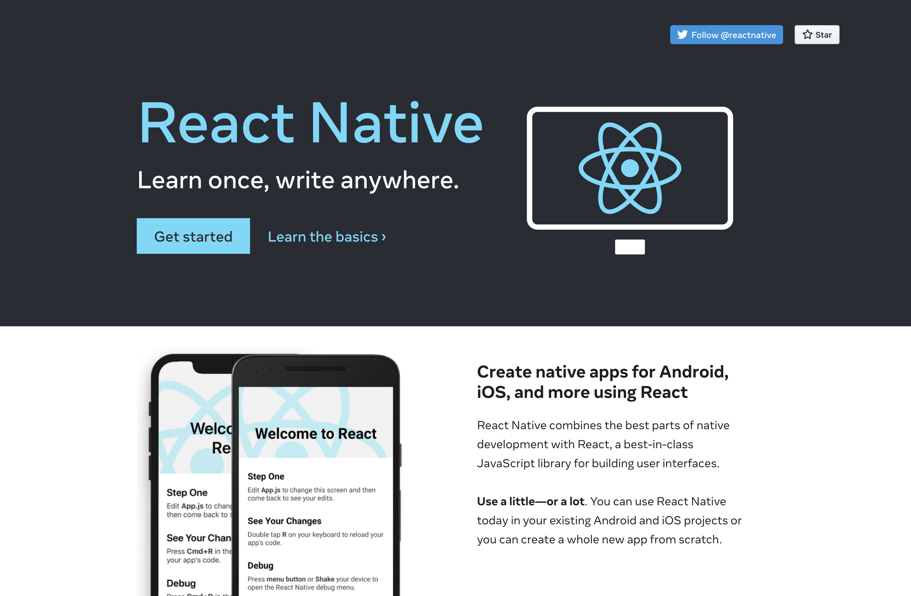
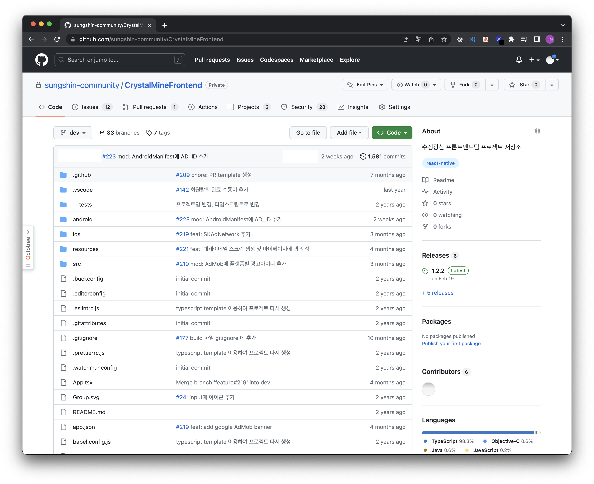
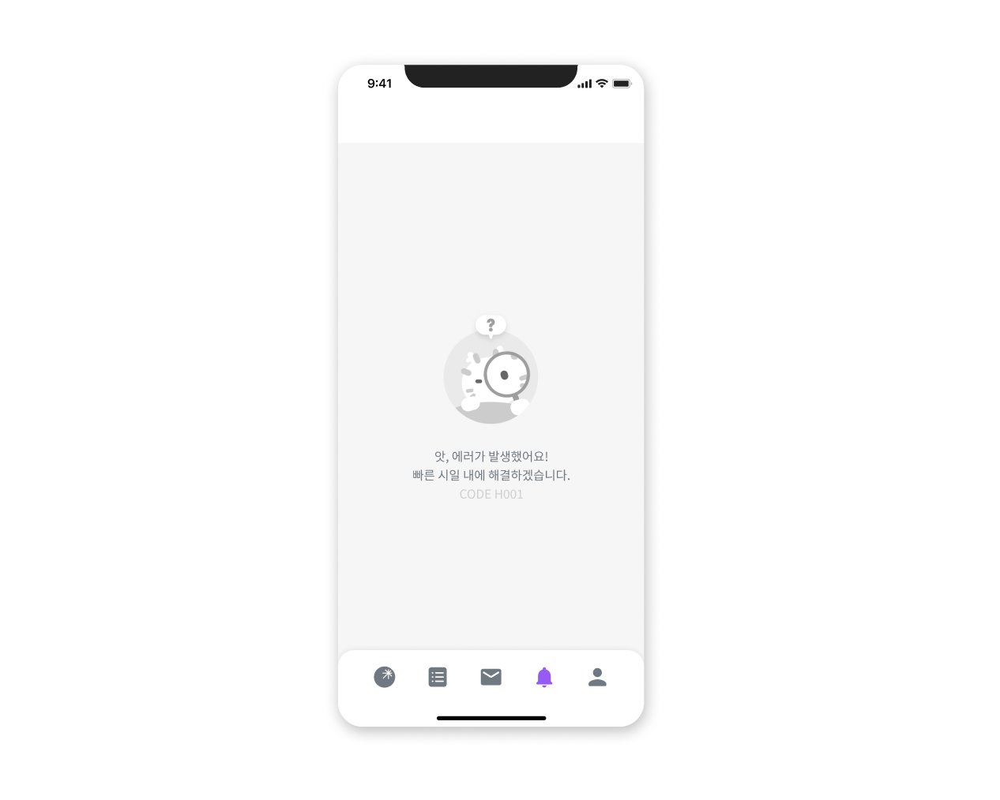
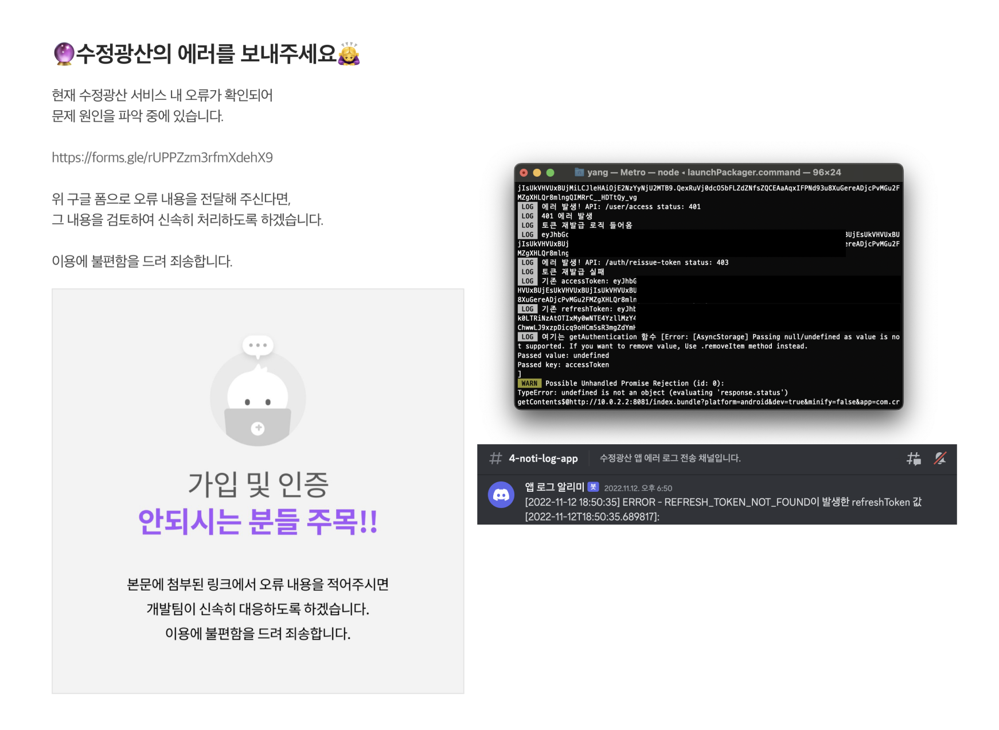
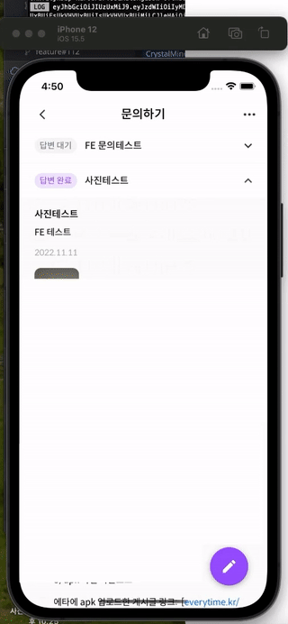
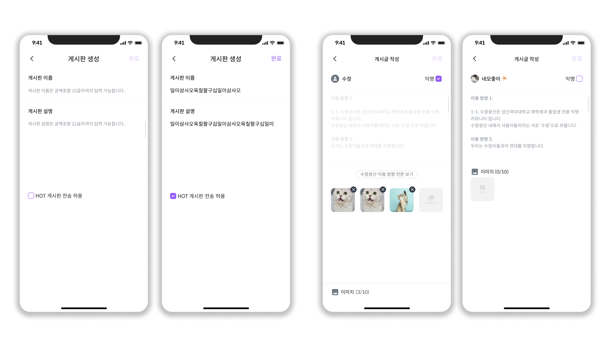
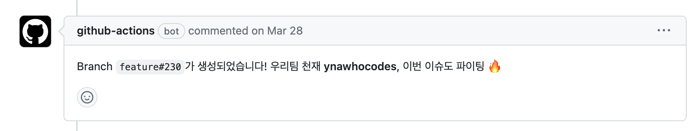

안녕하세요. [수정광산 서비스](https://ynawhocodes.github.io/projects/crystalmine/)의 개발에 대해 더 자세히 얘기하려고 합니다.

## ⚛️ 왜 React Native를 선택하셨나요?

  
우선 적은 인원이었기 때문에 크로스 플랫폼 앱으로 개발해야 겠다고 생각했습니다.
### 1. 성능 비교
> 버벅이는 앱 딱 싫더라...
아무래도 네이티브 앱보다는 성능이 좋지 않을 거라 예상했고, 사용자의 입장에서 성능이 가장 중요하다고 생각했기 때문에 크로스 플랫폼 중 성능 비교부터 우선으로 했습니다.
조사 결과 성능과 속도는 일반적으로 Flutter가 좋다고 알려져 있었습니다. 그러나 대다수의 스마트폰이 소프트웨어의 속도 차이가 거의 느껴지지 않을 정도로 이미 고도화되어 있어 차이는 미비하다고 하여 Flutter보다 네이티브 코드 (iOS, android 전용 코드)를 작성할 수 있게 해준다는 장점이 있는 React Native로 마음이 기울어졌습니다. 카메라 앱 등 모바일 장치를 사용할 예정이기 때문에 비교적 더 나은 성능 제어력을 가질 수 있다고 생각했기 때문입니다.

### 2. 진입
> React랑 정말 비슷하잖아!!!
프로젝트 진행 초기에 React 스터디를 진행하고 있었기에 RN으로 프로젝트를 진행하면 학습에 시너지가 날 것이라 생각했습니다. 또한, React가 대중적인 웹 라이브러리다 보니 다음 기수 모집할 때도 수월할 것 같다는 생각을 했습니다.
  
### 3. 생태계
> 안정성있는 프레임워크인가...? 믿어도 될까...?
RN이 Flutter에 비해 역사가 조금 더 오래되어 커뮤니티가 더 크고, 버그 등이 생겼을 경우에 참고할 만한 자료가 조금 더 많았습니다. RN의 역사가 더욱 오래된 만큼, Flutter에 비해 더 많은 라이브러리가 존재했고, 해당 라이브러리의 안정성 또한 더욱 높아, 다양한 라이브러리를 사용할 때의 원인 모를 버그에 대비할 수 있다고 생각했습니다.
## 📁 GitHub 보여주면서 프로젝트 설명 가능할까요?
> 수정광산은 나에게 애지중지하며 키운 서비스(자식 같은 느낌)...
현재 repo가 private이라 많이 아쉽습니다... 최대한 보여줄 수 있는 부분은 다 보여드리고 싶습니다...

FE팀 0기는 총 2명(초기엔 4명이었는데 개인 사정상 나가셨습니다), 1기도 2명으로 구성되어있습니다.
0기에 [아쉬웠던 점](#2-개발-몰입도) 바탕으로 보완하여 1기를 인수인계했고 현재는 1.3.0 버전까지 업데이트된 상황입니다.
  
### 1. 디렉토리 구조
> 어떻게 네이밍을 해야 직관성이 있을까?
화면과 기능의 규모가 커질수록 파일 관리의 중요성을 점점 느꼈습니다.
규모가 더 커져도 팀원 모두가 작업을 원활히 할 수 있도록 작업 시작 전 팀원끼리 네이밍 회의를 하거나 문서화를 필수로 했습니다.
```
  🔮 CrystalMineFrontend
  └── 📂 src
	      |──  📂 classes // DTO 정의
	      |──  📂 common // API 호출 함수
	      |──  📂 components // 컴포넌트
	      └──  📂 screens // 화면 스크린
              |── 📂 board // 게시판
              |── 📂 createBoard // 04.게시판-게시판 탭 > 게시판 생성
              │    │    |── CreateBoard.tsx // 게시판 생성 02
              │    │	  |── DirectionAgree.tsx // 게시판 생성 01
              │    │    └── UpdateBoard.tsx // 게시판 수정 01
              │    │── MyCommentList.tsx // 05. 게시판-게시글 상세보기 >  내 댓글 모아보기
              │    │── MyPostList.tsx // 05. 게시판-게시글 상세보기 > 내 글 모아보기
              │    │── ScrapedPostList.tsx // 05. 게시판-게시글 상세보기 > 스크랩 글 모아보기
              │    │── TagSearchResult.tsx // 05. 게시판-게시글 상세보기 > 검색 결과 조회 03
              │    └── WikiTab.js // 05. 게시판-게시글 상세보기 > 성신 위키 룩
              │── 📂 errorScreen // 에러 화면
              │    └── ErrorScreen.tsx
              │── 📂 fragments // 탭 
              │   |── AlertFragement.tsx // 0+.알림
              │   |── BoardFragment.tsx // 04.게시판-게시판 탭
              │   |── HomeFragement.tsx // 03.홈 > 홈 01
              │   └── MyPageFragment.tsx // 03.홈 > 쪽지 01
              │── 📂 mypage // 07.마이페이지
              │    |── 📂 blindMemberAccess 
              │    │    └── InformationUse.tsx // 03.홈 > 개별 이용 방향 안내 페이지(홈)
              │    |── 📂 changePassword // 비밀번호 재설정
              │    │    |── InputNewPassword.tsx
              │    │	  |── InputNewPasswordConfirm.tsx
              │    │    └── InputPassword.tsx
              │    |── 📂 informationUse // 이용안내
              │    │    |── 📂 quitMembership // 탈퇴 화면
              │    │    │    |── QuitComplete.tsx // 회원탈퇴 07
              │    │    │    |── QuitPassword.tsx // 회원탈퇴 04
              │    │    │    └── QuitTermAgree.tsx  // 회원탈퇴 01
              │    │	  |── LabScreen.tsx // 실험실
              │    │	  |── ListScreen.tsx // 이용안내 01
              │    │	  |── Notice.tsx // 이용안내 07
              │    │	  |── NoticeList.tsx // 이용안내 06
              │    │	  |── OpenSourceLicense.tsx // 이용안내 08
              │    │	  |── TermsOfService.tsx // 이용안내 04
              │    │    └── UsageRestrictions.tsx // 이용안내 03-1
              │    |── 📂 regularMemberAuth // 정회원 인증
              │    │    |── CertifiedMember.tsx // 정회원 인증 02
              │    │	  |── DirectionAgreeMyPage.tsx // 
              │    │    |── ExpiredMember.tsx // 정회원 인증 04
              │    │	  |── RegularMemberAuthMyPage.tsx  // 정회원 인증 05
              │    │    └── UncertifiedMember.tsx // 정회원 인증 01
              │    |── ChangeMajor.tsx // 프로필 수정 05-1
              │    |── ChangeNickname.tsx // 프로필 수정 03-1
              │    |── DirectionAgreeScreen.tsx // 이용안내 05
              │    |── QuestionList.tsx // 문의하기 01-1
              │    └── QuestionWriteScreen.tsx // 문의하기 04-1
              │── 📂 post // 게시글 상세
              │    |── ImageViewerScreen.tsx // 06. 게시판-게시글 상세보기 > 게시글 이미지 03
              │    |── PostListScreen.tsx // 05. 게시판-게시글 상세보기
              │    |── PostScreen.tsx // 06. 게시판-게시글 상세보기
              │    └── PostWriteScreen.tsx // 06. 게시판-게시글 상세보기 > 게시글 작성
              │── 📂 search // 검색
              │    |── 📂 total 
              │    │    |── BoardSearchResult.tsx // 홈 검색 03-3: 게시판
              │    │    |── PostSearchResult.tsx // 홈 검색 03-1: 게시글
              │ 	 │    |── TotalSearch.tsx // 홈 검색 01: 노멀 룩
              │ 	 │    └── TotalSearchResult.tsx // 홈 검색 03
              │    |── MyCommentSearch.tsx // 05. 게시판-게시판 상세 보기 > 게시판 내 검색 5
              │    |── MyCommentSearchResult.tsx // 내가 쓴 댓글 검색 결과 화면 (피그마에 없음)
              │    |── MyPostList.tsx // 내가 작성한 글 검색 결과 > 게시글 탭 (피그마에 없음)
              │    |── MyPostSearch.tsx // 05. 게시판-게시판 상세 보기 > 게시판 내 검색 4
              │    |── MyPostSearchResult.tsx // 내가 쓴 글 검색 결과 화면 (피그마에 없음)
              │    |── PostList.tsx // 05. 게시판-게시판 상세 보기 > 검색 결과 조회  01 (게시글 탭)
              │    |── PostSearch.tsx // 05. 게시판-게시판 상세 보기 > 게시판 내 검색 01
              │    |── PostSearchResult.tsx // 05. 게시판-게시판 상세 보기 > 검색 결과 조회  01
              │    |── ScrapedPostList.tsx // 내가 스크랩한 글 검색 결과 > 게시글 탭 (피그마에 없음)
              │    |── ScrapedPostSearch.tsx // 05. 게시판-게시판 상세 보기 > 게시판 내 검색 6
              │    |── ScrapedPostSearchResult.tsx // 내가 스크랩한 글 검색 결과 화면 (피그마에 없음)
              │    └── WikiSearchResult.tsx // 성신위키 검색 결과 화면 (피그마에 없음)
              │── 📂 signIn // 01. 로그인
              │       |── ResetPasswordInputId.tsx  // 비밀번호 재설정 01
              │       |── ResetPasswordInputNewPassword.tsx  // 비밀번호 재설정 07
              │       |── ResetPasswordInputNewPasswordConfirm.tsx //  비밀번호 재설정 09
              │       |── ResetPasswordInputRegularMemberAuthNumber.tsx // 비밀번호 재설정 04
              │       |── SignInId.tsx // 로그인 02
              │       └── SignInPassword.tsx // 로그인 05
              │── 📂 signUp // 02. 회원가입
              │       |── CreateMailGuide.tsx // 회원가입 07: 수정광산 아이디 등록방법
              │       |── DirectionAgree.tsx // 정회원 인증 02
              │       |── MajorSelect.tsx / 회원가입 11
              │       |── PortalVerificationMethodGuide.tsx // 회원가입 07: 포탈시스템으로 인증하기
              │       |── RegualrMemberAuth.tsx // 정회원 인증 05
              │       |── RegularMemberAuthSelect.tsx // 정회원 인증 01
              │       |── SignUpComplete.tsx // 회원가입 12
              │       |── SignUpId.tsx // 회원가입 05
              │       |── SignUpNickname.tsx // 회원가입 10
              │       |── SignUpPassword.tsx // 회원가입 08
              │       |── SignUpPasswordConfirm.tsx // 회원가입 09
              │       └── TermAgree.tsx // 회원가입 02
              └── SplashHome.tsx // 01.로그인 >  로그인 01

```
### 2. 컴포넌트 구성
> 어떻게 구상해야 컴포넌트 재사용성을 높일 수 있을까?
여러 컴포넌트 중 인풋과 버튼 컴포넌트를 소개해보겠습니다.
<table>
  <tr>
    <td>컴포넌트 종류</td>
    <td>컴포넌트명</td>
    <td>컴포넌트 설명</td>
    <td>속성</td>
    <td>설명</td>
    <td>import해야 할 파일</td>
  </tr>
  <tr>
    <td rowspan=2>텍스트</td>
    <td rowspan=2>TwoLineTitle</td>
    <td rowspan=2>두줄짜리 큰 텍스트</td>
    <td>firstLineText</td>
    <td>첫번째줄에 올 텍스트</td>
    <td rowspan=2>/src/components/Top</td>
  </tr>
    <td>TwoLineTitle</td>
    <td>두번째줄에 올 텍스트</td>
  </tr>
  <tr>
    <td rowspan=6>입력창</td>
    <td rowspan=2>FocusInput</td>
    <td rowspan=2>인풋창 탭 시(보라)</td>
    <td>MiddleFocusInput</td>
    <td>작은 인풋창</td>
    <td rowspan=6>/src/components/Input</td>
  </tr>
    <td>BigFocusInput</td>
    <td>큰 인풋창</td>
  </tr>
  <tr>
    <td rowspan=2>ErrorInput</td>
    <td rowspan=2>인풋창 오류(빨강)</td>
    <td>MiddleErrorInput</td>
    <td>작은 인풋창</td>
  </tr>
    <td>BigErrorInput</td>
    <td>큰 인풋창</td>
  </tr>
  <tr>
    <td rowspan=2>InactiveInput</td>
    <td rowspan=2>인풋창 비활성화(회색)</td>
    <td>MiddleInactiveInput</td>
    <td>작은 인풋창</td>
  </tr>
    <td>BigInactiveInput</td>
    <td>큰 인풋창</td>
  </tr>
  <tr>
    <td rowspan=12>버튼</td>
    <td rowspan=2>PurpleRoundButton</td>
    <td rowspan=2>모서리가 둥근 보라색 버튼</td>
    <td>text</td>
    <td>버튼 텍스트</td>
    <td rowspan=2>/src/components/Button</td>
  </tr>
    <td>onClick</td>
    <td>클릭 이벤트 처리 함수</td>
  </tr>
  </tr>
    <td rowspan=2>DisabledPurpleRoundButton</td>
    <td rowspan=2>비활성화된 PurpleRoundButton</td>
    <td>text</td>
    <td>버튼 텍스트</td>
    <td rowspan=2>/src/components/Button</td>
  </tr>
    <td>onClick</td>
    <td>클릭 이벤트 처리 함수</td>
  </tr>
  <tr>
    <td rowspan=2>WhiteRoundButton</td>
    <td rowspan=2>모서리가 둥근 흰색 버튼</td>
    <td>text</td>
    <td>버튼 텍스트</td>
    <td rowspan=2>/src/components/Button</td>
  </tr>
    <td>onClick</td>
    <td>클릭 이벤트 처리 함수</td>
  </tr>
  <tr>
    <td rowspan=2>DisabledWhiteRoundButton</td>
    <td rowspan=2>비활성화된 WhiteRoundButton</td>
    <td>text</td>
    <td>버튼 텍스트</td>
    <td rowspan=2>/src/components/Button</td>
  </tr>
    <td>onClick</td>
    <td>클릭 이벤트 처리 함수</td>
  </tr>
  <tr>
    <td rowspan=2>PurpleFullButton</td>
    <td rowspan=2>너비가 화면에 꽉 차는 각진 보라색 버튼</td>
    <td>text</td>
    <td>버튼 텍스트</td>
    <td rowspan=2>/src/components/Button</td>
  </tr>
    <td>onClick</td>
    <td>클릭 이벤트 처리 함수</td>
  </tr>
  <tr>
    <td rowspan=2>DisabledPurpleFullButton</td>
    <td rowspan=2>비활성화된 PurpleFullButton</td>
    <td>text</td>
    <td>버튼 텍스트</td>
    <td rowspan=2>/src/components/Button</td>
  </tr>
    <td>onClick</td>
    <td>클릭 이벤트 처리 함수</td>
  </tr>
</table>


- Input Component
```js
<MiddleFocusInput placeholder="플레이스홀더" title="도움말은 여기에 표시됩니다." />
<MiddleErrorInput placeholder="플레이스홀더" title="도움말은 여기에 표시됩니다." />
<MiddleInactiveInput placeholder="플레이스홀더" title="도움말은 여기에 표시됩니다." />
<BigFocusInput placeholder="플레이스홀더" title="도움말은 여기에 표시됩니다." />
<BigErrorInput placeholder="플레이스홀더" title="도움말은 여기에 표시됩니다." />
<BigInactiveInput placeholder="플레이스홀더" title="도움말은 여기에 표시됩니다." />
```


- Button Component
```js
<WhiteRoundButton text='다음' />
<DisabledWhiteRoundButton text='다음' />
<PurpleRoundButton text='다음' />
<DisabledPurpleRoundButton text='다음' />
<PurpleFullButton text='다음' />
<DisabledPurpleFullButton text='다음' />
```


### 3. 분기 처리
> 어떻게 분기 처리를 해야 에러가 발생해도 사용자가 당황하지 않을 수 있을까?

  
다양한 HTTP 상태 코드에 따라 대응을 할 수 있도록 서버 호출 때마다 에러 처리를 했습니다.
특히 500 에러일 경우 영역별로 지정해둔 에러 코드도 함께 화면에 노출되도록 해두어 에러가 났을 경우 빠른 원인 파악으로 빠른 해결을 할 수 있도록 하였습니다.
```js
...
let result = await sendEmail();
  if (result.status === 401) {
    setTimeout(function () {
      Toast.show(
        '토큰 정보가 만료되어 로그인 화면으로 이동합니다',
        Toast.SHORT,
      );
    }, 100);
    logout();
    navigation.reset({routes: [{name: 'SplashHome'}]});
  } else if (getHundredsDigit(result.status) === 2) {
    setTimeout(function () {
      Toast.show(
        '메일을 성공적으로 전송했습니다.',
        Toast.SHORT,
      );
    }, 100);
    navigation.navigate('RegularMemberAuth');
  } else if (result.data.code === 'AUTH_COOL_TIME_LIMIT') {
    console.log('이메일 발송 실패');
    setIsCoolTime(true);
  } else if (
    result.data.code === 'PORTAL_VERIFICATION_NOT_COMPLETED'
  ) {
    // 이 로직 탈 경우는 없지만 혹시 모르니 추가함
    navigation.navigate('PortalVerificationMethodGuide');
  } else
    setTimeout(function () {
      Toast.show(
        '알 수 없는 오류가 발생하였습니다.',
        Toast.SHORT,
      );
    }, 100);
...
```

## 🪡 어려웠던 부분 궁금해요!
### 1. 자동 로그아웃 문제

1️⃣ **에러 발생**

서비스 출시 후 강제 로그아웃 이슈로 사용자가 많은 불편을 겪은 장애가 있었습니다. 

2️⃣ **장애 해결을 위한 노력**


로그에는 사용자들이 로그아웃될 때마다 REFRESH_TOKEN_NOT_FOUND 오류코드 출력되었기에 만료된 refresh Token으로 토큰 재발급을 요청 부분이 잘못되었거나, 토큰 재발급 후 받은 새로운 refresh Token을 제대로 기기에 저장하고 있지 않다고 생각했습니다. 하지만 이 부분에서 버그를 찾을 수 없었기에 오류 보고 구글폼을 생성하여 사용자들에게 참여를 부탁했습니다. 설문 결과와 로그를 통해 글 목록을 이용할 때 강제 로그아웃이 된다는 경험이 많다는 걸 알 수 있었습니다.

3️⃣ **원인**
  

예상대로 장애 상황을 구현해보니 스크린의 n%만큼 글 목록이 차지할 경우 다음 페이지의 글 목록을 불러오는 API를 호출하기 때문에 글 목록화면에서 마지막 글 postItem이 스크린의 n% 부분에 애매하게 걸쳐질 경우 다음 페이지를 무한으로 호출하는 이슈가 발생하였습니다. 

API를 무한으로 호출하고 있는 사이 refreshtoken을 받아야할 경우 401에러가 발생했고 이는 접근 권한 없음으로 강제 로그아웃까지 되는 장애가 일어나 사용자가 불편을 겪어야했습니다. 

4️⃣ **해결 방법과 느낀점**

```jsx
...
onEndReached={() => if (currentPage !== lastPage) fetchNextPage()}
...
```

```jsx
const fetchNextPage = async () => {
    setIsNextPageLoading(true);
   ...
      let thisPagePostList: ContentPreviewDto[] = await getBoardDetail(
        route.params.boardId,
        currentPage + 1,
        sortBy,
      );
      setBoardDetail(boardDetail.concat(thisPagePostList));
      if (thisPagePostList.length > 0) {
        setCurrentPage(currentPage + 1);
      }
		...
    setIsNextPageLoading(false);
  };
```

마지막 페이지일 경우엔 다음페이지를 호출 안하도록 코드를 수정하여 불필요한 API 호출을 최소화할 수 있었습니다. 해당 에러는 재발생을 방지하고자 문서화하여 팀 내 공유하였습니다. 또한 사소하다고 생각할 수 있는 에러처리를 안할 경우 예상치도 못 한 문제와 엮어 더 큰 에러를 발생할 수 있다는 것을 배울 수 있었습니다.
### 2. setState로 인해 체크 박스 상태 값이 잘 적용되지 않는 문제
1️⃣ **에러 발생**  

위와 같이 게시판 생성과 게시글 작성에는 텍스트 필드와 체크 박스 필드가 있습니다. 체크 박스를 체크나 해제 후 텍스트를 작성하면 체크 박스 상태 값이 제대로 상태 반영이 되는데, 텍스트부터 작성 후 체크 박스를 체크하거나 해제하면 체크 박스 상태값이 적용이 안되어 게시판의 HOT 게시판 정보와 글의 익명 여부가 풀리는 등의 문제가 발생하였습니다.

2️⃣ **장애 해결을 위한 노력**  
  
그래서 다음과 같이 useEffect로 익명 여부와 작성 상태 여부(제목과 글을 모두 작성하였는지 상태 검사),이미지의 상태 변화를 주시하며 게시글 작성 완료 버튼을 누를 수 있도록 제어를 했습니다.
```js
  useEffect(() => {
    if (isSubmitState) {
      onSubmitPress();
    }
  }, [isAnonymous, isSubmitState, images]);
```
하지만 의문이 생겼습니다. 그럼 setState가 제대로 작동할 때와 제대로 작동 안할 때의 차이가 뭔지 궁금했습니다.

3️⃣ **원인**
  
구글링을 통해 알아보니 setState는 batch update라는 비동기적 특성으로 인해 이런 문제가 생겼던 것이었습니다.
React는 setState가 연속으로 호출된다면 batch update를 통해 이를 한 번에 렌더링한다고 합니다. 즉 useState는 비동기적으로 작동하는 것이고 이렇게 비동기적으로 동작하는 이유는 불필요한 랜더링을 방지하여 성능을 향상하기 위함이라고 합니다. (useState가 동기적으로 동작 시 디버깅에 큰 어려움이 야기될 수 있기 때문)
  
4️⃣ **해결 방법과 느낀점**
  
해결 방법을 알아본 결과 두가지 방법이 있었는데 한가지는 useEffect를 사용한 기존 방법이었고,
다른 한가지는 setState에 인자로, 업데이트 할 값이 아닌 콜백 함수를 주는 방법이었습니다.
```js
  onPress={() => {
      setIsAnonymous(current => !current);
  }}>
```
이 오류로 인해 학습에 있어 왜?가 중요하다는 걸 느낄 수 있었습니다. (학습할 때 setState의 인자로 콜백 함수를 넣는 게 좋다는 말에 의문을 갖지 않은 저를 반성했습니다...)
## ✨ 신경썼던 부분있나요?
### 1. 성능
1️⃣ **virtual scrolling 이용**  
성능을 위해 ScrollView 이용하지 않고 FlatList 이용하였습니다.

2️⃣ **외부 라이브러리 최소화**  
RN은 앱을 부팅하기 전에 모든 JS 코드를 로드하고 구문 분석하므로 외부 라이브러리를 최소화하고 직접 구현하였습니다. (Modal 컴포넌트, Input 컴포넌트 등등)
    
만약 외부 라이러리를 사용해야할 경우 패키지 트렌드를 알려주는 사이트를 이용하여 라이브러리의 크기, 최신 업데이트, 업데이트 주기, star 수를 비교하며 선택하였습니다.
    
3️⃣ **불필요한 함수 재생성 방지**

```jsx
// 댓글 생성
  const addCommentFunc = useCallback(
    async (postId: number, newComment: string, isAnonymous: boolean) => {
      setIsLoading(true);
      const response = await addComment(postId, newComment, isAnonymous);
      if (response.status === 401) {
        setTimeout(function () {
          Toast.show(
            '토큰 정보가 만료되어 로그인 화면으로 이동합니다',
            Toast.SHORT,
          );
        }, 100);
        logout();
        navigation.reset({routes: [{name: 'SplashHome'}]});
  ...
```

위와 같이 자주 쓰이는 함수는 useCallback을 이용하여 컴포넌트가 리렌더링될 때 만들어두었던 함수를 재사용할 수 있도록 구현했습니다.
  
### 2. 개발 몰입도
> GitHub Action을 통한 branch 생성 자동화

프로젝트 브랜치 이름 생성 컨벤션은 다음과 같았습니다.

```jsx
feat#{이슈번호} / fix#{이슈번호}
```

브랜치 이름에 규칙이 있었으므로 이슈 생성할 때 tag 옵션, issue 번호에 따라 브랜치가 자동으로 생성되도록 GitHub action을 통해 환경을 구축해두어 기능 개발에 더욱 집중할 수 있도록 하였습니다.

```toc
```