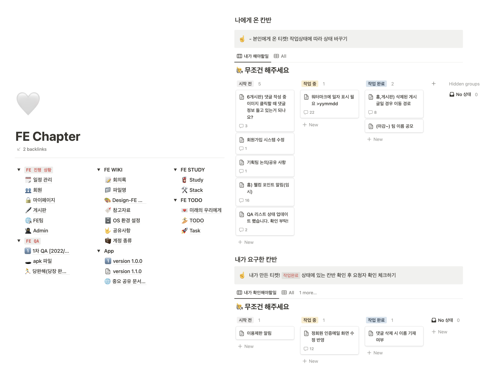

안녕하세요. 1년 동안 애지중지한 자대 커뮤니티 앱 서비스를 소개하려고 합니다.
  
## 🫂 왜 만들게 되었나요?
학교에 다니며 동문끼리 정보 공유하는 공간에 대한 갈증이 늘 있었습니다. 에브리타임 외에 동문이 만든 서비스가 있는 대학들이 부러웠기 때문입니다😋 제가 대학 졸업하기 전 자대 서비스를 만들고, 제 동문이 제가 소망했던 공간에서 활발히 정보 교류를 할 수 있길 바라면서 개발에 참여했습니다.
## 🫧 서비스 소개
> 오로지 성신인만을 위한 커뮤니티!

  
수정광산은 React Native로 개발한 성신여자대학교 커뮤니티 앱으로 기획부터 디자인, 개발, 운영까지 모두 성신인이 참여한 서비스입니다. 자대 출신만 이용할 수 있기에 학교 메일로 받은 인증 번호를 통해 가입할 수 있습니다. 커뮤니티로서 로그인, 회원가입, 게시판, 글, 댓글, 마이페이지, 알림, 홈 기능 등이 있습니다. 
## 🤹 서비스에서 담당한 부분은 무엇인가요?
> 기여도 59%!!!! 구성원 3인!!!!


세부 기능 303개 중의 178개의 기능을 담당했습니다.
저는 크게 홈, 정회원 인증, 게시글/댓글, 마이페이지의 비밀번호 재설정, 문의하기, 이용 안내 등을 맡았습니다. 
## 🗓️ 프로젝트 진행 과정은 어땠나요?
> '더 좋은 게 있지 않을까'의 연속
1년 동안 매주 회의를 가지며 더 나은 서비스를 만들기 위해 모두가 노력했습니다.


저는 FE PL로서 개발뿐만이 아니라 일정도 관리했습니다. Notion에 JIRA와 비슷하게 템플릿을 만들어두어 팀원들이 작업을 한눈에 파악하고 작업 요청도 쉽게 할 수 있도록 노력했습니다.
## 💦 하면서 어려운 점은 없었나요?
### 1. 일정
> FE가 말단이라 일정에 치여요...
일정을 관리하며 가장 어려웠던 점은 팀별로 싱크를 맞추는 일이었습니다. 한 기능을 구현하더라도 기획팀의 기능 명세서 진행 상황, 디자인팀의 화면 디자인 진행 상황, BE팀의 API 구현 상황 등 진행 여부를 확인해야 했고, FE팀의 작업이 말단이라 중간 과정에 수정사항이 생기면 일정에 치이는 일이 종종 발생했습니다.
그래서 세분된 기능을 기준으로 컬럼을 나누어 각 팀당 진행 여부를 적을 수 있는 공간을 만들었습니다.


이 노션 페이지 덕분에 불필요한 소통을 최소화 할 수 있었고 개발에 더욱 집중할 수 있었습니다.
### 2. 개발
> 사용자 중심 사고로 생각하기!!!
처음 다뤄보는 프레임워크라 개발 초기엔 많은 시간을 소비했고 어려움이 많았습니다. 그럼에도 불구하고 사용자 접근성, 주어진 리소스를 고려하여 React Native로 개발했고 FE 팀원들과 공식 문서 기반으로 스터디를 진행했습니다. 

개발자이기도 하면서 미래의 사용자이기에 기술 구현 가능성에 초점을 맞추기보다 기술 구현을 위해 개발 실력을 높이는 데 초점을 맞췄습니다. 성능 개선할 부분이 있는지, 불필요한 리소스를 줄일 방법이 있는지 등 효율적으로 개발하기 위해 힘을 쏟았습니다. 
출시 이후에도 여러 시행착오들이 있었는데 [링크](https://ynawhocodes.github.io/projects/crystalmine-tech/)를 누르시면 더 자세히 알 수 있습니다.

## 🚀 드디어 출시!!! 성과는???
**2022/09/01** 2학기 개강에 맞추어 서비스를 출시했습니다.

많은 동문이 기다려주어 앱 출시 후 App Store 네트워크 부분 12위까지 달성할 수 있었습니다. 또한 사용자 수는 글을 쓰는 지금(2023년 5월)기준으로 6천명을 달성했습니다.

## ⚙️ 끝날 때까지 끝난 게 아니지!
성공적 출시 이후, 현재는 운영을 담당하고 있습니다. 올해 초 1기에게 인수인계 후, 1기가 메인 기능을 개발할 수 있도록 저는 사용자의 피드백을 정리하여 서비스에 반영하는 소소한 개발을 하고 있습니다.
또한 사용자 관리를 위해 [수정광산 어드민 웹 서비스](https://ynawhocodes.github.io/projects/crystalmine-admin/)도 개발 중입니다.
## 💭 회고
개발자로서 사용자로서 출시만을 기다린 서비스였습니다. 개발 초반에는 처음 다뤄본 프레임워크로 6개월에 1개의 기능밖에 구현하지 못 했는데 팀원들과의 스터디를 통해 3배 이상의 기능을 구현할 수 있었습니다. 또한 QA를 위해 테스트 앱도 배포해보고 상상치도 못 한 에러들도 마주해보며 수정광산에서 희로애락을 맛볼 수 있었습니다.  

이 경험을 통해 새로운 언어, 새로운 프레임워크여도 알고 있던 지식만 잘 정리되어 있다면 해낼 수 있다는 자신감을 얻게 되었습니다. 점점 기능이 추가되어 사용자 수가 늘고 있는데 정말 뿌듯합니다... 더 많은 성신인들이 사용할 수 있도록 힘을 쏟을 예정입니다.

```toc
```