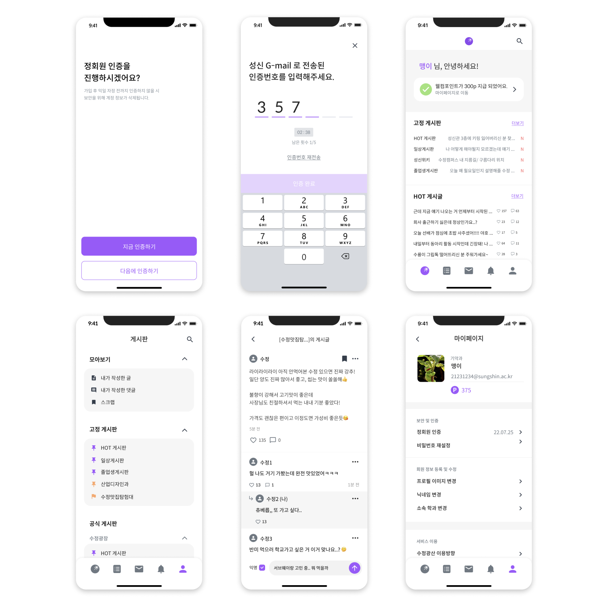
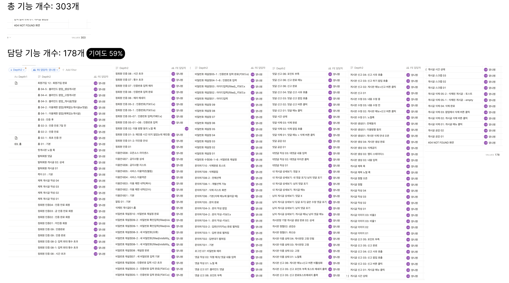
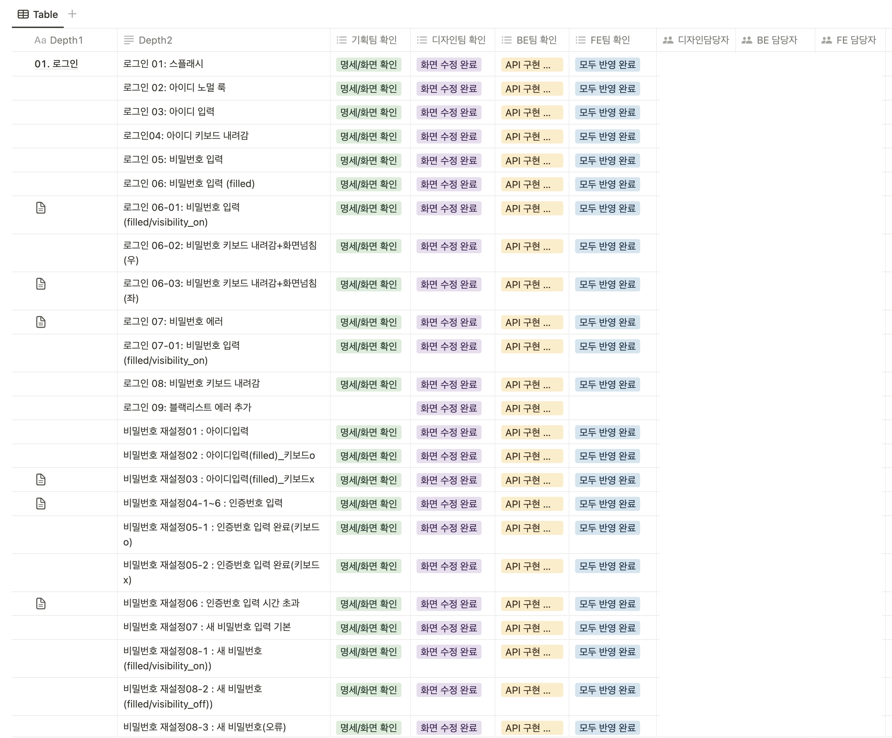
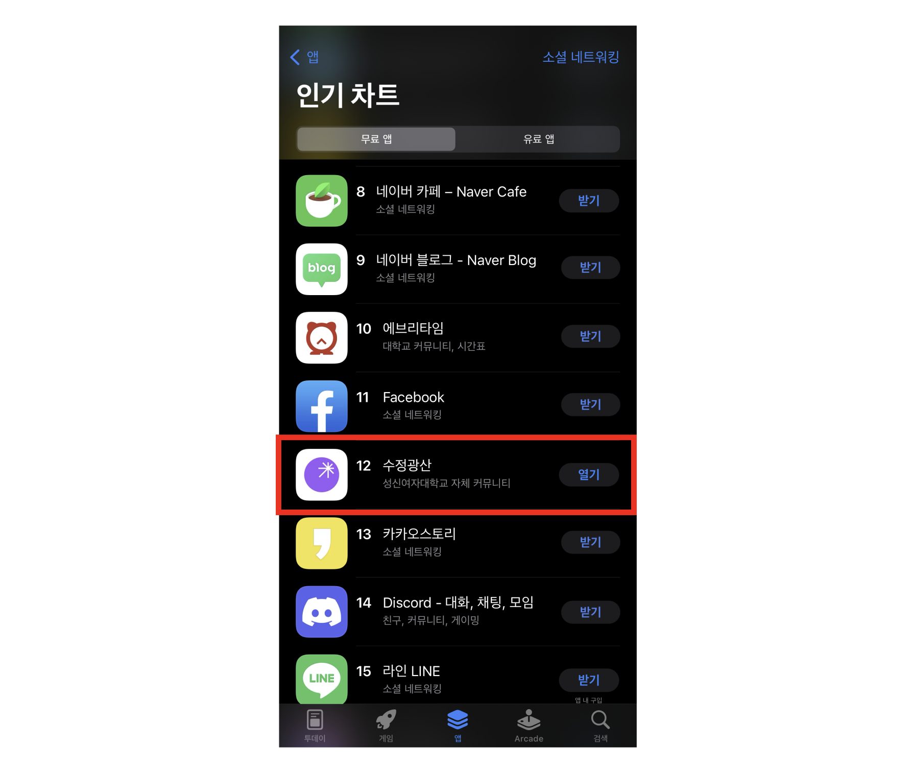

안녕하세요. 1년 동안 애지중지한 자대 커뮤니티 앱 서비스를 소개하려고 합니다.
  
## 🫂 왜 만들게 되었나요?
학교를 다니며 동문끼리 정보 공유하는 공간에 대한 갈증이 늘 있었습니다. 에브리타임 외에 동문이 만든 서비스가 있는 대학들이 부러웠기 때문입니다. 제가 대학 졸업하기 전 자대 서비스를 만들고, 제 동문들이 제가 소망했던 공간에서 활발히 정보 교류를 할 수 있길 바라면서 개발에 참여했습니다.
## 🫧 서비스 소개

  
수정광산은 성신여자대학교 커뮤니티 앱으로 기획부터 디자인, 개발, 운영까지 모두 성신인이 참여한 서비스입니다. 자대 출신만 이용이 가능하기에 학교 메일로 받은 인증 번호를 이용해 가입할 수 있습니다. 커뮤니티로서 로그인, 회원가입, 게시판, 글, 댓글, 마이페이지, 알림, 홈 기능 등이 있습니다. 
## 🤹 서비스에서 담당한 부분은 무엇인가요?


세부 기능 303개 중에 178개의 기능을 담당했습니다.
저는 크게 홈, 정회원 인증, 게시글/댓글, 마이페이지의 비밀번호 재설정, 문의하기, 이용 안내 등을 맡았습니다. 
## 🗓️ 프로젝트 진행 과정은 어땠나요?
0기로 첫 출발이라 가야할 길은 막막했지만 반대로 나아갈 길을 스스로 만들 수 있다는 장점이 있었습니다.

기획팀, 디자인팀, FE팀, BE팀은 매주 회의를 가졌습니다.

- [ ]  회의록 사진

저는 FE PL로 개발뿐만이 아니라 일정관리에도 신경썼습니다.

- [ ]  FE팀 노션 사진
## 💦 하면서 어려운 점은 없었나요?
### 1. 일정
일정을 관리하며 가장 어려웠던 점은 팀별로 싱크를 맞추는 일이었습니다. 한 기능을 구현하더라도 기획팀의 기능 명세서 진행 상황, 디자인팀의 화면 디자인 진행 상황, BE팀의 API 구현 상황 등 진행 여부를 확인해야 했고, FE팀의 작업이 말단이라 중간 과정에 수정사항이 생기면  일정에 치이는 일이 종종 발생했습니다.

그래서 세분화된 기능을 기준으로 컬럼을 나누어 각 팀당 진행 여부를 적을 수 있는 공간을 만들었습니다



이 노션 페이지 덕분에 불필요한 소통을 최소화 할 수 있었고 개발에 더욱 집중할 수 있었습니다.
### 2. 개발
처음 다뤄보는 React native 프레임워크라 개발 초기엔 많은 시간을 소비했고 어려움이 많았습니다. 그럼에도 불구하고 사용자 접근성, 주어진 리소스를 고려하여 React native로 개발했고 FE 팀원들과 공식 문서 기반으로 스터디를 진행했습니다. 

개발자이기도 하면서 미래의 사용자이기에 기술 구현 가능성에 초점을 맞추기보다 기술 구현을 위해 개발 실력을 높이는 데 초점을 맞췄습니다. 성능 개선할 부분이 있는지, 불필요한 리소스를 줄일 방법이 있는지 등 효율적으로 개발하기 위해 힘을 쏟았습니다. 
출시 이후에도 일어난 에러들로 사용자들이 불편해했던 경험도 있었습니다. 하지만 여러 시도들로 해결할 수 있었고 자세한 기술적 내용은 링크를 눌러 읽어주시면 감사하겠습니다.

## 🚀 드디어 출시!!! 성과는???
**2022/09/01** 2학기 개강에 맞추어 서비스를 출시했습니다.

많은 동문들이 기다려주어 앱 출시 후 App Store 네트워크 부분 12위까지 할 수 있었습니다. 글을 쓰는 지금(2023년 5월)기준으로는 사용자 수 6천명을 달성했습니다.

## ⚙️ 끝날 때까지 끝난 게 아니지!
성공적 출시 이후, 현재는 운영을 담당하고 있습니다. 
## 💭 회고

```toc
```