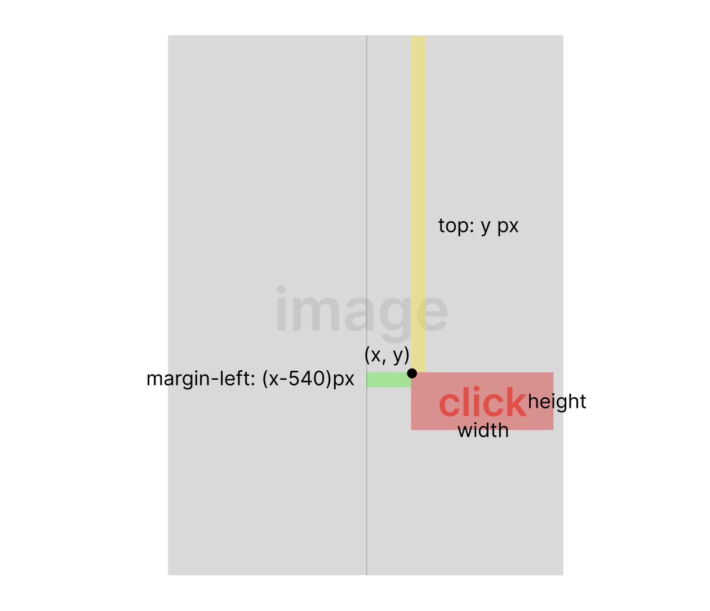

안녕하세요. [무신사에서 근무](https://ynawhocodes.github.io/activities/musinsa/)를 하며 개발한 자동화 프로그램에 대해 소개하려고 합니다.
## ⏰ 왜 개발해야겠다고 생각했나요?
 저는 무신사에서 스페셜이슈와 기획전과 같은 이벤트를 담당했습니다. 이벤트가 많은 의류 회사다 보니 하루에도 많은 이벤트 페이지를 제작해야 했습니다. 급한 건은 당일 안에 제작해야 하기도 했고, 이벤트 당 수정사항이 생길 경우 여러 이벤트를 병렬적으로 처리해야 했기에 업무 몰입도가 떨어져 휴먼에러가 발생하기도 했습니다. 이벤트는 시간과 정확도가 중요하다고 생각했기에 **이대로 안 되겠다!!!! 내가 할 수 있는 게 없을까????** 라는 생각에서 시작한 프로젝트입니다.
  
## 👥 어떻게 구상했나요?
기존 작업자분께 시간을 단축시킬 방법을, 저와 함께 작업하시는 분께는 작업 중 불편한 점을 여쭤보며 구상을 시작하였습니다. 그 결과 가장 시간이 많이 걸리는 부분은 이미지에서 클릭 영역 위치를 잡는 부분이었습니다. 

## 👣 기존엔 어떻게 작업했는데요?

이미지의 클릭 영역을 클릭하면 원하는 링크로 이동시키기 위해 크롭한 이미지의 클릭 영역에 맞춰 margin-left 값과 top 값을 구해야했습니다. 가장 빠르게 값을 구하는 방법은 감을 믿고 값을 맞추는 방법이었고 보통은 개발자 도구로 해당 값을 바꿔가며 클릭 영역 위치에 a 태그가 제대로 이동할 때까지 반복했습니다. 게다가 PC 버전은 px, Mobile 버전은 %로 값을 구해야 했기에 두 번 작업을 해야 했습니다.

## ⚡️ 프로그램의 핵심기능은!!
### 1. 드래그로 값 구하기  
이미지의 클릭 영역을 드래그하면 top, margin-left 값을 자동으로 구해주도록 개발하였습니다.  
이미지 딥러닝에서 많이 쓰이고 있는 OpenCV 라이브러리를 이용했습니다.
> OpenCV란?  
> Open Source Computer Vision Library의 약어로 실시간 컴퓨터 비전을 목적으로 한 프로그래밍 라이브러리이다. 실시간 이미지 프로세싱에 중점을 둔 라이브러리다. 응용 기술로는 인간과 컴퓨터의 상호작용(HCI), 물체 인식, 안면 인식, 모바일 로보틱스, 제스쳐인식이 있다.  
> 출처: https://ko.wikipedia.org/wiki/OpenCV


> 이미지 출처: https://pyimagesearch.com/2021/03/29/multi-template-matching-with-opencv/ 

OpenCV 라이브러리를 처음 다뤄보기에 먼저 개념을 공부하고 개념을 바탕으로 응용하는데 힘을 썼습니다. OpenCV의 cv2 모듈로 이미지 일부를 드래그하여 이미지를 추출하는 방식을 응용하였습니다. 드래그 영역의 x, y좌표를 구해 다음과 같이 top, margin-left, width, height 값을 계산하였습니다.

  
### 2. px 값으로 Mobile % 값 계산하기
1번에서 구한 top, margin-left 값을 Mobile에도 적용하기 위해서
```
Mobile 가로 사이즈 비율 = PC 가로 사이즈 / 10.8
Mobile 세로 사이즈 비율 = PC 세로 사이즈 * 100 / 이미지 높이
```
위 공식을 이용하여 이미지 높이와 화면 사이즈에 상관없이 클릭 영역이 잘 위치하도록 했습니다.
   
## 🔧 자세한 기능 설명
기능은 크게 4가지로 나눌 수 있습니다.


1. [작업할 폴더 열기](/#1-작업할-폴더-열기)
2. [정보 입력하기](/#2-정보-입력하기)
3. [클릭 영역 드래그하기](#3-클릭-영역-드래그하기)
4. [생성된 HTML 파일 확인하기](/#4-생성된-html-파일-확인하기)

### 1. 작업할 폴더 열기
첫 번째로 이미지 경로의 찾아보기를 눌러 작업할 폴더를 선택하면 됩니다.  
폴더 선택과 동시에 해당 폴더에 있는 이미지의 개수와 이미지 사이즈를 계산하고 자동으로 이미지 파일명을 전부 변경합니다.
또한 이미지 경로를 저장해두어 작업 후 HTML 파일을 저장할 때나 결과물을 미리 볼 때 이용합니다.
### 2. 정보 입력하기
서버에 올린 이미지의 경로, 배경색, 링크 연결이 필요한 이미지 인덱스를 작성하면 HTML 템플릿 코드에 해당 정보를 추가됩니다.
### 3. 클릭 영역 드래그하기

작성한 이미지 인텍스를 이용하여 이미지를 띄워줍니다. 링크 영역을 드래그 후 엔터를 누르면 됩니다.
인덱스가 끝날 때까지 다음 이미지를 띄워줍니다.
### 4. 생성된 HTML 파일 확인하기

  
모든 과정이 끝난 후 저장 버튼을 누르면 PC 버전, Mobile 버전 두 개의 HTML이 생성됩니다. PC, MB 미리보기 버튼을 눌러 결과물을 확인할 수 있습니다.
  

  
HTML파일을 VScode로 열어보면 CSS와 HTML이 잘 생성된 걸 확인할 수 있습니다.
## 🎉 성과
**작업 소요시간 80% 감소!!!!!**  
기존 30분 걸렸던 작업을 5분 안에 끝낼 수 있었습니다.  
개발까지의 과정과 사용 방법을 사내 confluence에 작성해두어 사내에서 공유 중입니다. 
팀장님께서 개발 부서 회의 시간에 해당 문서를 공유해주셔서 타팀의 팀장님들과 리더님도 문서를 읽어보신 점이 정말 뿌듯했습니다.
  

## 📄 그 이후?

이에 그치지 않고 프로그램을 사용 중이신 분의 피드백을 차곡차곡 반영해두었습니다. ([Release Note](https://github.com/ynawhocodes/self-perish-project#release-note))  
또한 퇴사 이후에 팀원분들의 기기가 Mac으로 바뀌어 팀원분의 요구로 OS 버전도 대응했습니다.
## 💭 회고
 작업 시간이 많이 단축되면 '나... 필요 없어지겠는데 ...?' 라는 걱정으로 시작하여 자기 소멸 프로젝트라는 이름을 붙이고 프로젝트를 진행했습니다. 걱정과 달리 불필요한 리소스를 줄이고 업무 효율이 높아질 것이라는 기대에 더욱 몰입해서 진행할 수 있었습니다. 처음 써보는 라이브러리로 개념 공부부터 시작하여 응용하기 위해 여러 테스트를 해보는 과정 속에서 많이 성장할 수 있었습니다. 또한 구현 여부에 집중하기보다는 팀원분들의 피드백을 받으며 더 나은 방향으로 개발하기 위해 요구에 개발 가능성을 맞췄고, 문제를 해결할 때까지 몰입했던 소중한 경험을 할 수 있었습니다.
더 나은 업무 환경을 위한, 주도적으로 프로그램을 개발하는 기쁨을 느꼈고 다행히 결과도 매우 성공적이라 소중한 큰 경험을 할 수 있었습니다.

코드와 기타 설명, 사용 방법은 GitHub에 더 자세히 나와있으니 관심 있으시면 들려주세요!  
[👉 GitHub repo로 이동하기](https://github.com/ynawhocodes/self-perish-project)
