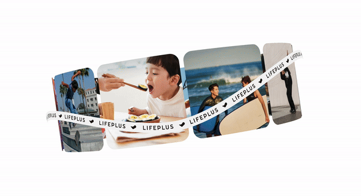
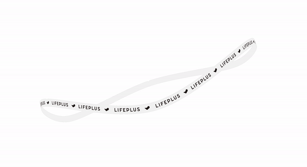
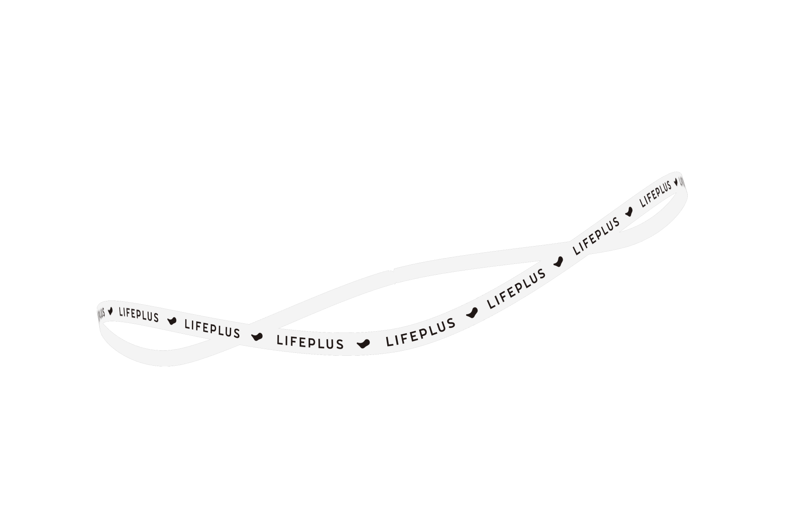
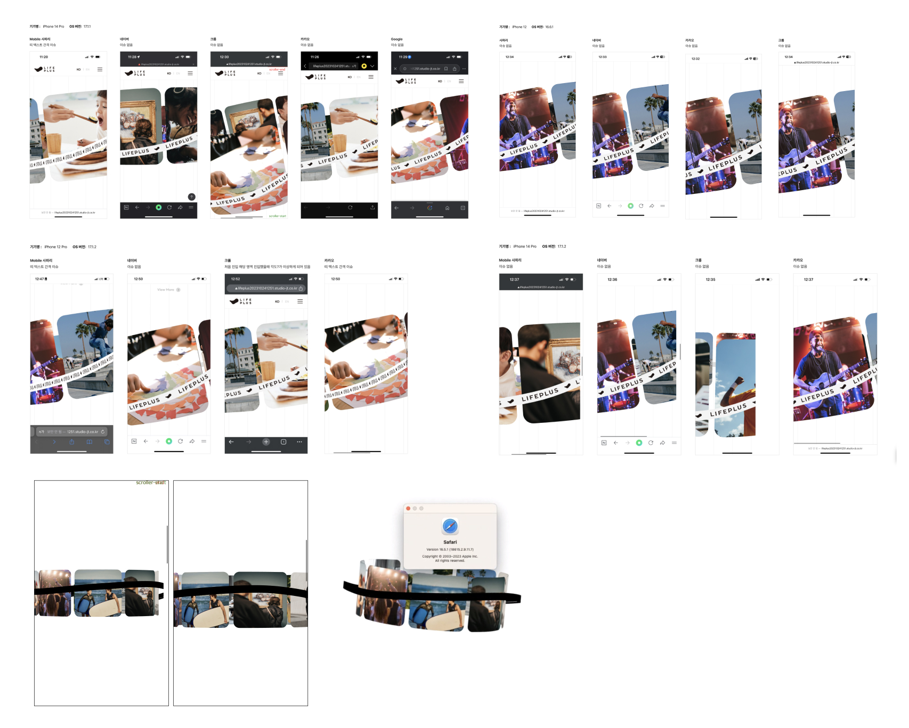
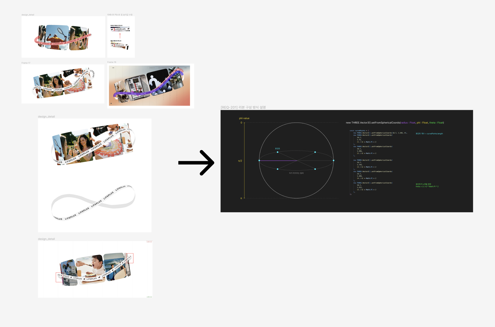
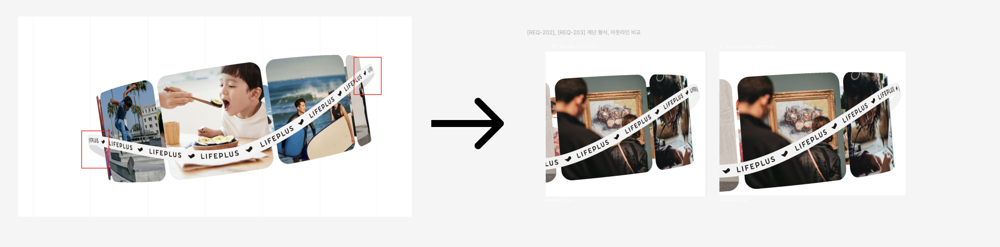
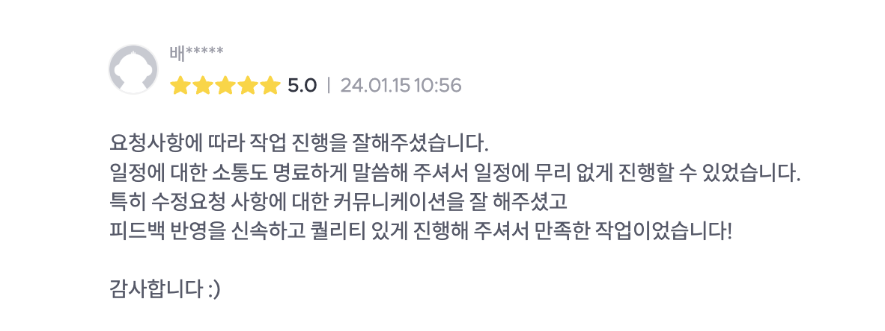

안녕하세요.   
오늘은 3D 리본 만드는 과정을 소개하려고 합니다.  

  

영원 활동으로 외주를 시작하고나서 처음 들어온 건으로, 디자인 에이전시 JT-STUDIO의 의뢰를 받아 한화 라이프플러스 랜딩페이지 중 인터렉션 섹션 개발을 맡게 되었습니다.  
  
3D로 돌아가는 캐러셀과 캐러셀 밖의 리본 띠였습니다.
그 중에 전 리본 띠를 맡아 개발을 진행했습니다.  
  
  
리본 띠의는 구형으로 돌아가되 곡선 형태로 회전하며, 띠는 자체적으로 회전해야했습니다.  

## 👀 어떻게 시작했나요?  
우선 띠가 원형이면서도 구부러지는 효과가 있어야 했기에 띠가 위치할 수 있는 curve가 구형의 적도에 있어야겠다고 생각을 했고, 적도 부근에 위치한 curve 형태를 직접 휘게 만드는 방식으로 접근했습니다.  
그리고 생성한 curve를 기준으로 material이 이동하면 리본이 생성될 것이라고 예상하여 시작했고, 많은 시행착오 끝에 완성할 수 있었습니다.  

  
## 🌐 리본이 이동할 수 있을 curve 생성부터
구형에 적도에 위치할 수 있으려면 구면 좌표가 필요했고, [setFromSphericalCoords](https://threejs.org/docs/#api/en/math/Vector3.setFromSpherical) 메서드를 통해 반지름, 방위각, 극각 매개변수를 통해 curve를 구면 좌표에 구부림을 나타낼 수 있는 제어점 위치를 설정했습니다. 
```
 const curvePoints = [
        new THREE.Vector3().setFromSphericalCoords(18.7, 1.585, 0),
        ...
        new THREE.Vector3().setFromSphericalCoords(
            18.7,
            1.552,
            (5 / 6) * Math.PI * 2
        ),
    ];
```

제어점을 기반으로 곡선을 생성하기 위해 [CatmullRomCurve3](https://threejs.org/docs/?q=CatmullRomCurve3#api/en/extras/curves/CatmullRomCurve3) 메서드를 이용했습니다. 설정한 제어점 위치가 있는 배열 인자로 넣어 부드러운 곡선을 생성하였습니다.  
```
  const curve = new THREE.CatmullRomCurve3(curvePoints);
  curve.closed = true;
```  

## 🎀 curve 따라 돌 리본 준비
리본은 평면이기에 PlaneGeometry로 모양을 정의했고, 메쉬는 특별한 텍스쳐가 없기에 간단한 텍스쳐인 MeshBasicMaterial로 평면의 외관을 정의했습니다. 또한 리본은 한화 라이프플러스 로고가 담긴 이미지가 적용되었기에 [TextureLoader](https://threejs.org/docs/?q=TextureLoader#api/en/loaders/TextureLoader)로 로고 이미지를 입혔습니다.
```
  let texture = new THREE.TextureLoader().load(RIBBON_SRC);

  [texture].forEach((t) => {
      t.wrapS = THREE.RepeatWrapping;
      t.wrapT = THREE.RepeatWrapping;
      t.repeat.set(7, 1);
      t.flipY = false;
  });

  const frontMaterial = new THREE.MeshBasicMaterial({
  ...
  });

  // 리본의 일부
  let tempPlane = new THREE.PlaneGeometry(1, 1, number, 1);
```  

## 🧶 준비한 리본 curve따라 돌리기 시작
  - **curve를 잘게 쪼개 평면 생성할 수 있도록 접선, 이접선 계산**   
  주어진 curve에 리본 평면을 세분화해서 붙이기 위해, getSpacedPoints을 이용해 curve를 일정한 간격으로 나누고, 간격을 나눈 점을 기준으로 computeFrenetFrames을 이용해 FrenetFrame을 계산합니다. FrenetFrame이란 해당 점에서의 접선 방향과 그에 수직인 이접선 방향으로 구성한 평면을 의미하며, 두번째 인자 true 설정으로 시작점과 끝점이 서로 연결되도록 설정했습니다.
    
    ```
      let spacedPoints = curve.getSpacedPoints(number);
      let frenetFrames = curve.computeFrenetFrames(number, true);
    ``` 

- **각 점에 대해 두께 반영**  
  spacedPoints를 하나씩 움직이며 리본의 두께인 dimension을 적용했습니다.
  ```
    let dimension = [-0.45, 0.45];

    dimension.forEach((d) => {
      for (let i = 0; i <= number; i++) {
        let point = spacedPoints[i];

        binormalShift.add(frenetFrames.binormals[i]).multiplyScalar(d);
        finalPoints.push(new THREE.Vector3().copy(point).add(binormalShift));
      }
    });
  ```
  - binormalShift.add(frenetFrames.binormals[i]).multiplyScalar(d)  
    Frenet 프레임에서 현재 인덱스에 해당하는 이접선(binormal)을 가져와서 d 값에 따라 크기를 조정한 후 binormalShift에 더했습니다 
  - finalPoints.push(new THREE.Vector3().copy(point).add(binormalShift))
    현재 포인트에 이전에 계산한 이접선의 변위를 추가하여 새로운 포인트를 생성하고, 이를 finalPoints 배열에 추가했습니다.  
  
  이렇게 길고 긴 과정을 통해 finalPoints 배열에는 주어진 curve를 따라 하나씩 이동하면서, 이전 포인트에서의 이접선에 따른 변위가 적용된 새로운 포인트들이 들어있고, 이 포인트들로 평면을 정의할 수 있도록 했습니다.

- **열심히 구한 점들에 평면들 다닥다닥 붙이기**
  ```
    tempPlane.setFromPoints(finalPoints);
    let finalMesh = new THREE.Mesh(tempPlane, [frontMaterial, frontMaterial]);

    group.add(finalMesh);
  ```
  리본 두께 모양으로 다닥다닥 구한 점들에 평면을 두르고, 로고 이미지 텍스쳐로 정의한 material이 입혀주면 리본이 완성됩니다!!!!!!!!!!  



(혼자 기립박수 👏👏👏👏👏 )  

## ⛈️ 하면서 어려웠던 점....
### 1) 브라우저 호환성 이슈 해결  

  
  위 첨부 사진과 같이 브라우저 종류에 따라, 버전에 따라 이슈가 있었습니다. 리본 이미지가 렌더링되지 않거나, 리본 이미지의 패턴화가 통일되지 않은 점이었습니다. 리본 이미지를 텍스쳐로 사용하는 로직에 문제가 있을 것이라 생각하고 해당 로직부터 살펴보았습니다.  

  리본 이미지를 불러오는 메소드, 반복해서 wrappingg하는 메소드 중심으로 three 공식 github와 issue 게시판을 모두 읽고 수정/반영해보는 과정 속에서 해결을 할 수 있었습니다.  

  해당 문제는 [이슈]()로 ~ 하는 문제가 있었습니다.   
  따라서 이미지의 세로, 가로 사이즈를 2의 배수로 변경하여 해결하였습니다.
  브라우저별/버전별로 이슈가 해결됐는지 확인한 후 해당 이슈를 완료한 경험이 있습니다. 

### 2) 인터렉션 커뮤니케이션 개선  
  
  
    

  디자이너가 원하는 모션을 최대한 정확히 구현하기 위해선 프로토타입이나 영상이 필요하나, 있어도 정확하지 않을 수 있고, 수정사항 발생 시 디자이너도 개발자도 커뮤니케이션 비용이 많이 

## ☀️ 세상이 모든 것이 아름다워보였던 마무리 순간
  
